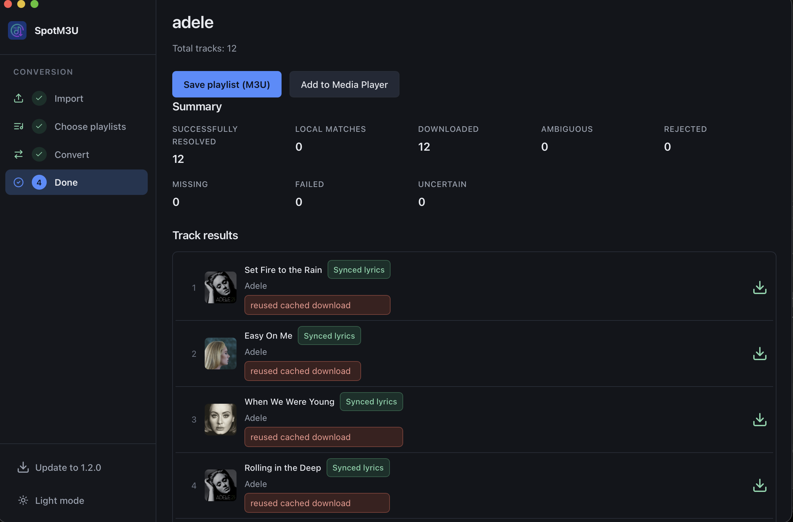
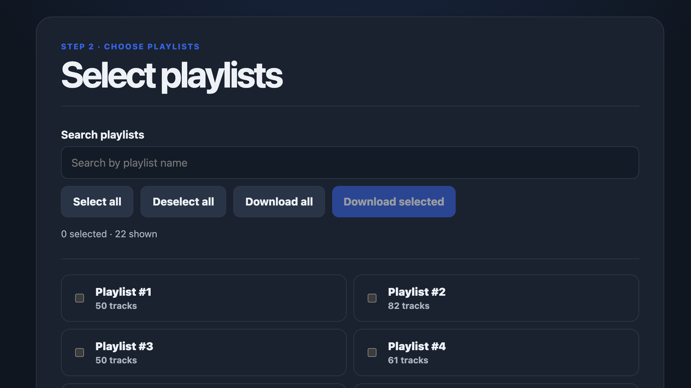
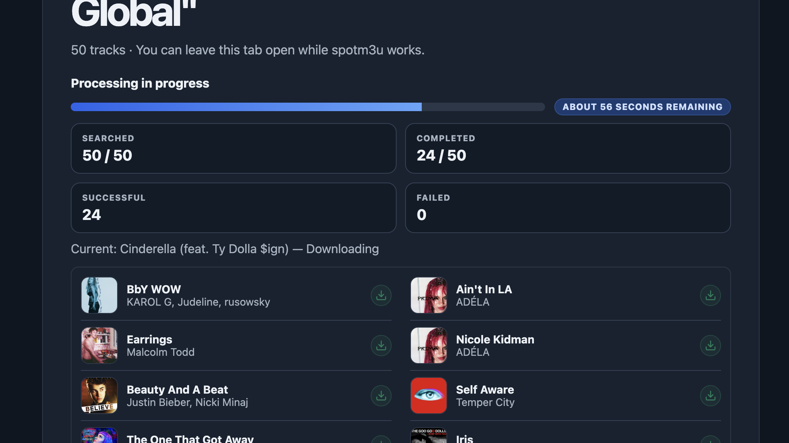

# spotm3u

[](https://github.com/p55d2k/spotm3u/actions/workflows/ci.yml)
[](https://www.python.org/)
[](LICENSE)

spotm3u turns Spotify playlists exported from [Exportify](https://exportify.net/) into M3U playlists for music already on your computer.

## Download

- [Download for Windows](https://github.com/p55d2k/spotm3u/releases)
- [Download for macOS](https://github.com/p55d2k/spotm3u/releases)
- [Download for Linux](https://github.com/p55d2k/spotm3u/releases)

## Quick start

Exportify → Download → Launch → Upload ZIP → Get M3U

1. Exportify → export your Spotify playlists and download the ZIP.
2. Download → get the spotm3u app for your platform.
3. Launch → run the app and open <http://127.0.0.1:5001/>.
4. Upload ZIP → drag in the Exportify ZIP and choose playlists.
5. Get M3U → review matches and download the generated playlist.

## Overview

spotm3u is a local Flask application that turns playlists exported from
[Exportify](https://exportify.net/) into M3U playlists for audio already on
your computer. When a track is not found locally, it can search for and
download a candidate recording, validate it, and keep the resulting MP3 for
later use.

The application does not log in to Spotify, request Spotify credentials, use
the Spotify Web API, scrape Spotify, or require Spotify Premium. Spotify
authentication and export happen in Exportify; spotm3u receives the downloaded
ZIP only.

## How it works

1. **Export** your playlists with Exportify and download its ZIP.
2. **Upload** the ZIP to spotm3u. The playlists are parsed locally.
3. **Choose** one or more playlists to process.
4. **Resolve** tracks from your local library first. Unmatched tracks can be
   searched, validated, and downloaded.
5. **Review** matched, unresolved, rejected, failed, and ambiguous tracks.
6. **Download** the generated M3U playlist.

Playlist order and intentional duplicate entries are preserved. Missing,
rejected, failed, and ambiguous tracks are reported instead of silently being
written as successful entries. On macOS, a completed playlist can also be sent
to the Music app.



## Installation

### Standalone release

Download the archive for your platform from
[GitHub Releases](https://github.com/p55d2k/spotm3u/releases), extract it, and
run the `spotm3u` executable (`spotm3u.exe` on Windows). Then open
<http://127.0.0.1:5001/>.

The release archives built by CI include a Python runtime, application
dependencies, and FFmpeg/ffprobe. They do not require Python, `uv`, or a
system FFmpeg installation. CI currently builds:

| Platform | Architecture | Archive suffix |
| --- | --- | --- |
| Windows | x86_64 | `windows-x86_64` |
| macOS | arm64 | `macos-arm64` |
| Linux | x86_64 | `linux-x86_64` |

The executables are not signed or notarized. macOS Gatekeeper or Windows
SmartScreen may display a warning on first launch. Apple Music integration is
macOS-only. A YouTube PO-token provider is an optional external service and is
not bundled; see [YouTube downloads](docs/troubleshooting.md#youtube-downloads).

### Run from source

Source usage requires Python 3.13+, [`uv`](https://docs.astral.sh/uv/), and
FFmpeg on `PATH` when online downloads need audio conversion:

```bash
git clone https://github.com/p55d2k/spotm3u.git
cd spotm3u
uv sync
uv run spotm3u
```

Open <http://127.0.0.1:5001/>. No Spotify account credentials or API key are
needed by spotm3u.

## Usage

1. Export playlists with Exportify and download its ZIP.
2. Start spotm3u and upload the ZIP.
3. Select one or more playlists.
4. Review local matches and any online resolution results.
5. Download the generated M3U.



The M3U references existing files and successfully downloaded MP3s. The
download directory defaults to `~/Music/spotm3u-downloads/` and can be changed
in `config.toml`. Configuration is optional; see the commented
[config.toml](config.toml) example.

YouTube downloads can require a signed-in browser session. Configure
`download.cookies_from_browser` only when needed; browser cookies are read
locally by yt-dlp and are not stored or logged by spotm3u. PO tokens do not
replace browser authentication. Provider setup and common failures are
documented in [troubleshooting](docs/troubleshooting.md).



## Documentation

- [Development](docs/development.md) — local setup, checks, and project layout
- [Architecture](docs/architecture.md) — application boundaries and data flow
- [Packaging](docs/packaging.md) — PyInstaller bundles and FFmpeg staging
- [Releases](docs/releases.md) — tags, CI builds, verification, and publishing
- [Troubleshooting](docs/troubleshooting.md) — configuration and download issues
- [Exportify format](docs/exportify.md) — parser boundary and playlist semantics
- [Matching and source validation](docs/matching.md)
- [M3U output](docs/m3u.md)
- [Security design](docs/security.md)
- [Screenshot plan](docs/screenshots.md)

## Contributing and security

See [CONTRIBUTING.md](CONTRIBUTING.md) for the development and pull request
workflow. Report vulnerabilities privately according to
[SECURITY.md](SECURITY.md); do not open a public issue for an undisclosed
security problem.

## License

spotm3u is released under the [MIT License](LICENSE). The project uses
third-party software including Flask, Mutagen, yt-dlp, bgutil-ytdlp-pot-provider,
and FFmpeg. Release bundles must retain the applicable notices and source
information for distributed FFmpeg builds.
