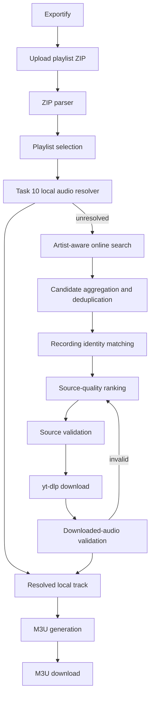

# Spotify to M3U Converter

> Turn an Exportify playlist export into a local, validated M3U playlist without
> requiring Spotify access in the application.

[](https://www.python.org/)
[](https://github.com/p55d2k/spotm3u/actions/workflows/ci.yml)
[](LICENSE)
[](https://github.com/astral-sh/ruff)

## Contents

- [Overview](#overview)
- [Features](#features)
- [Requirements](#requirements)
- [Quick start](#quick-start)
- [Usage](#usage)
- [Configuration](#configuration)
- [Architecture](#architecture)
- [Security](#security)
- [Development](#development)
- [License and acknowledgments](#license-and-acknowledgments)
- [Media assets](#media-assets)

## Overview

Spotify to M3U Converter (spotm3u) is a local Flask application for converting playlist metadata exported
by [Exportify](https://exportify.net/) into an M3U file that points to audio
files on the user's computer. It checks the local music library first, then
finds, validates, and downloads missing recordings with `yt-dlp`.

The app never logs into Spotify, asks for Spotify credentials, uses the Spotify
Web API, or scrapes Spotify. Spotify authentication and export happen in
Exportify; spotm3u receives only the resulting ZIP.

## Features

- 📦 **Exportify ZIP ingestion** — safely parses playlists, Unicode metadata,
  order, and intentional duplicate entries.
- 💾 **Task 10 local matching** — reuses existing audio before any network
  search or download.
- 🎯 **Artist-aware identity matching** — a title match cannot make a
  wrong-artist cover win.
- 🔎 **Source discovery and ranking** — aggregates candidates, separates
  recording identity from source quality, and prefers audio/lyrics sources over
  music videos for the same recording.
- 🔁 **Validation and fallback** — validates both the source and downloaded
  audio, retrying another plausible source when appropriate.
- 📝 **Lossless M3U export** — preserves playlist order and duplicates; failed
  or ambiguous tracks are reported rather than silently omitted.
- 🍎 **Apple Music export on macOS** — sends resolved local files to a Music
  playlist through the system automation interface and reports partial imports.
- 🛡️ **Resource and security controls** — bounded work, safe ZIP extraction,
  controlled paths, cleanup, and structured diagnostics.

> [!IMPORTANT]
> Exportify is the input boundary. Open Exportify, complete its export flow,
> download the ZIP, and upload that ZIP to spotm3u. This app does not handle
> Spotify authentication.

## Requirements

- Python 3.13 or newer
- [`uv`](https://docs.astral.sh/uv/)
- `ffmpeg` available on `PATH` for audio extraction and conversion
- Network access for online search and downloads

Local matching works without network access. No Spotify Premium account, API
key, or application credentials are required.

### Windows

Windows 10 or newer is supported. Install Python and `uv`, then install
`ffmpeg` from [gyan.dev](https://www.gyan.dev/ffmpeg/builds/) or
[winget](https://learn.microsoft.com/windows/package-manager/winget/):

```powershell
winget install Gyan.FFmpeg
```

Open a new terminal so `ffmpeg.exe` is on `PATH`, then use the same `uv sync`
and `uv run spotm3u` commands below. Configure Windows paths with TOML
forward slashes (for example `C:/Users/you/Music`) or `~`; no Unix shell,
`/tmp`, or POSIX-only dependency is required.

## Quick start

```bash
git clone https://github.com/p55d2k/spotm3u.git
cd spotm3u
uv sync
uv run spotm3u
```

Open <http://127.0.0.1:5001/>. Optional configuration can be copied from
`config.toml`; no `.env` file is required.

## Usage

1. Open [Exportify](https://exportify.net/) and complete its export flow.
2. Download the resulting ZIP.
3. Start spotm3u and upload the ZIP.
4. Select a playlist.
5. Let spotm3u try the local library before searching online.
6. Review resolved, missing, rejected, ambiguous, and uncertain tracks.
7. Download the generated M3U.

The M3U references existing local files and successfully downloaded MP3s. Its
entries remain in the original order, including duplicates. Tracks that cannot
be resolved are shown in the result and are never reported as successful.

### YouTube authentication

YouTube downloads are governed by two independent mechanisms that are often
confused with each other:

1. **Browser authentication** — cookies read locally from a browser where you
   are signed in to YouTube. This is what satisfies a signed-in session
   requirement such as YouTube's `LOGIN_REQUIRED` / "Sign in to confirm you're
   not a bot" response.
2. **PO Tokens** — proof-of-origin tokens that yt-dlp attaches to some YouTube
   requests. They can make traffic look more legitimate for some IPs, but they
   **do not** authenticate a session and **do not** guarantee bypassing bot
   checks or HTTP 403 errors.

spotm3u integrates the yt-dlp PO Token plugin
[`bgutil-ytdlp-pot-provider`](https://github.com/Brainicism/bgutil-ytdlp-pot-provider).
The tested combination is **yt-dlp 2026.8.19** with **bgutil plugin 2.0.0**.
YouTube's behavior and yt-dlp's error messages change frequently, so keep both
tools current; spotm3u's YouTube error handling is verified against the pinned
yt-dlp release and version-sensitive string messages.

#### Plugin and provider are separate components

- The **plugin** is the Python package `bgutil-ytdlp-pot-provider` that spotm3u
  installs via `uv sync`. It teaches yt-dlp how to ask for tokens.
- The **provider** is the software that actually generates tokens: either the
  bgutil HTTP server (Docker or a local checkout) or the bgutil script invoked
  by yt-dlp with Node.js/Deno.

Installing the plugin does **not** start a provider server. You must choose and
prepare one provider before PO tokens can be used. spotm3u never generates,
caches, logs, stores, or exposes PO tokens — they stay entirely inside
yt-dlp/bgutil.

The simplest cross-platform provider is Docker:

```bash
docker run --name bgutil-provider -d --init \
  -p 127.0.0.1:4416:4416 \
  brainicism/bgutil-ytdlp-pot-provider:2.0.0
```

The loopback-only binding is intentional: the provider is an unauthenticated
token service, so do not publish it to the network. If it runs on another URL,
set it in your private `config.toml`:

```toml
[download]
pot_provider_url = "http://127.0.0.1:8080"
```

Alternatively, point to a native provider checkout built with Node.js 22+ or
Deno 2.4.3+ (`npm ci && npx tsc` for Node):

```toml
[download]
pot_provider_home = "~/bgutil-ytdlp-pot-provider/server"
```

When a provider is configured, spotm3u validates it before yt-dlp starts:
HTTP providers are checked with `GET /ping` and compared by major version with
the installed plugin, and script providers must contain the expected built
artifact (`build/generate_once.js` or `src/generate_once.ts`) with a matching
runtime on `PATH`. Validation never executes arbitrary paths, and provider URLs
with embedded credentials are never written to logs or error messages.

#### When YouTube requires authentication

Some videos require a signed-in session. spotm3u supports yt-dlp's local
browser-cookie extraction. Sign in to YouTube in a supported browser, then set
the browser name in your private `config.toml`:

```toml
[download]
cookies_from_browser = "chrome"
```

Supported values are `chrome`, `chromium`, `firefox`, `safari`, `edge`,
`brave`, `opera`, `vivaldi`, and `whale`. You can also set
`SPOTM3U_YTDLP_BROWSER=firefox` for a local environment override. Cookies are
read locally by yt-dlp, are never copied into the project, logs, or API
responses, and should not be committed to Git.

When YouTube needs a session and no browser is configured, spotm3u raises a
clear error telling you to configure `download.cookies_from_browser`; it does
not pretend a PO Token replaces authentication, and it does not retry a
sequence of player clients hoping one works. The same messages explain:

- **PO-token/provider failure** — the configured provider is missing, down, or
  version-mismatched; start or rebuild the provider.
- **Browser-cookie failure** — the configured browser's cookies could not be
  read (for example a locked or undecryptable database); sign in, close the
  browser, or choose another one.
- **Rate limiting / captcha** — YouTube throttled the request or asked for a
  captcha; wait, lower `download.workers`, or use a signed-in session.
- **Private, members-only, or age-restricted content** — the video needs an
  account with access; configure browser cookies if you have it.

For a quick diagnostic of what yt-dlp sees, call the helper
`spotm3u.online.describe_youtube_setup(...)`. It reports the yt-dlp version,
whether the bgutil plugin is importable, whether a configured provider answers
`/ping`, the configured script runtime, and the configured browser — without
ever exposing cookies or PO tokens.

## Configuration

Configuration is optional TOML, loaded from `./config.toml` or the path in
`SPOTM3U_CONFIG`. Paths support `~`.

| Section/key                             | Default                             | Purpose                        |
| --------------------------------------- | ----------------------------------- | ------------------------------ |
| `web.port`                              | `5001`                              | Web server port                |
| `web.upload_root`                       | system temp/`spotm3u`               | Temporary upload/job root      |
| `web.music_library`                     | `~/Music`                           | Local audio search root        |
| `web.download_dir`                      | `<music_library>/spotm3u-downloads` | Persistent MP3 and M3U output  |
| `web.resolve_workers`                   | `4`                                 | Track resolution workers       |
| `web.log_level`                         | `INFO`                              | `DEBUG`, `INFO`, etc.          |
| `upload.max_upload_size`                | `50 MiB`                            | Compressed upload limit        |
| `upload.max_decompressed_size`          | `512 MiB`                           | Expanded archive limit         |
| `upload.max_archive_entries`            | `10000`                             | ZIP entry limit                |
| `upload.max_job_age`                    | `86400`                             | Stale job retention in seconds |
| `search.max_results`                    | `8`                                 | Results per search query       |
| `search.max_search_workers`             | `4`                                 | Search concurrency per track   |
| `search.socket_timeout`                 | `30`                                | Search socket timeout          |
| `download.audio_quality`                | `192`                               | MP3 bitrate                    |
| `download.workers`                      | `2`                                 | Download concurrency           |
| `download.timeout`                      | `600`                               | Per-download wall-clock limit  |
| `download.retries` / `fragment_retries` | `5` / `5`                           | yt-dlp retry limits            |
| `download.socket_timeout`               | `30`                                | Download socket timeout        |
| `download.cookies_from_browser`        | unset                              | YouTube authentication: local browser cookies |
| `download.pot_provider_url`            | unset (plugin default `127.0.0.1:4416`) | bgutil HTTP provider URL, `/ping`-validated before use |
| `download.pot_provider_home`          | unset (plugin default home)        | bgutil script checkout; Node 22+ / Deno 2.4.3+ |
| `m3u.extended` / `relative`             | `true` / `false`                    | M3U formatting                 |

`SPOTM3U_LOG_LEVEL` overrides the configured log level. See `config.toml` for
the complete commented example.

## Architecture



Identity and source quality are separate decisions. Explicit artist conflicts
reject a candidate even when its title is exact; missing metadata is not proof
of mismatch. Official audio and lyric sources can outrank an official music
video for the same recording, while an official music video remains a valid
fallback. Every downloaded file is validated before it reaches the M3U writer.

## Security

Uploaded ZIPs and all metadata are untrusted. spotm3u limits compressed and
expanded sizes, rejects unsafe archive paths, keeps temporary files in
controlled directories, bounds concurrent work and retries, and never executes
uploaded files. Download endpoints resolve server-owned job IDs rather than
accepting arbitrary filesystem paths. Credentials, tokens, and private
authentication data are not collected or logged.

> [!WARNING]
> Online source matching and audio-content detection are heuristic. Review
> reported uncertain or unresolved tracks before relying on a generated
> playlist.

## Development

```bash
uv sync --dev
uv run pytest
```

The same test suite runs in GitHub Actions. The reusable services live under
`src/spotm3u/`; tests are under `tests/`; architecture details are in `docs/`.

## License and acknowledgments

Released under the [MIT License](LICENSE). spotm3u uses and integrates with
the Exportify export format, [`yt-dlp`](https://github.com/yt-dlp/yt-dlp),
Flask, Mutagen, and ffmpeg.
