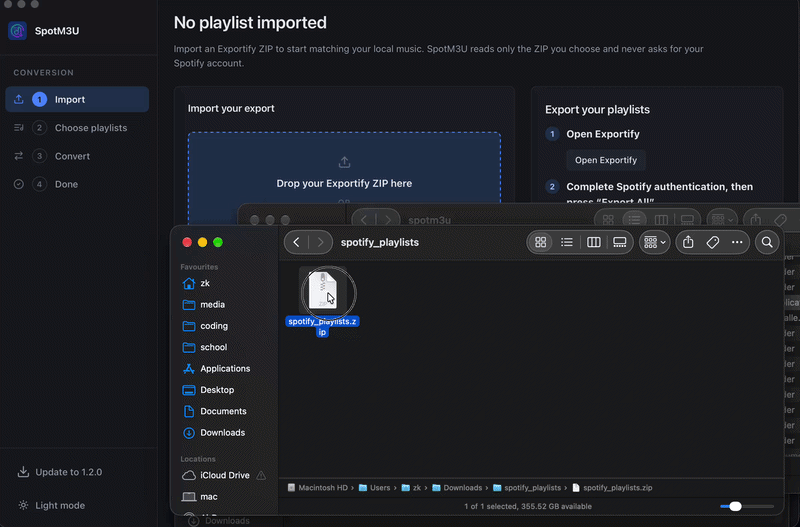

# Web Application

SpotM3U is a React single-page application served by Flask. In development,
`uv run dev` starts Vite and Flask together; in a production build, Flask serves
the compiled Vite output at `/`. The React client communicates with Flask
through the JSON API documented in [api.md](api.md).

```text
Exportify ZIP
→ import
→ playlist selection
→ processing
→ result
→ M3U download or media-player import
```



## Import

The import screen accepts an Exportify ZIP through a browser file picker or
drag-and-drop. In the desktop shell, **Choose ZIP** opens the native operating
system file dialog through the `WindowControls.choose_zip` bridge. The selected
path stays in the shell and is handed to Flask through
`POST /api/upload/picked`; the browser never submits an arbitrary local path.

## Playlist selection and processing

After import, SpotM3U displays the playlists found in the export. A single
playlist can be opened directly, or multiple playlists can be selected and
converted together. Each selected playlist gets independent progress, result,
and M3U output while shared audio resolution avoids duplicate work.

Processing resolves local audio first, then searches, ranks, validates, and
downloads an online match when necessary. Fast mode can skip slower enrichment
steps. Failed tracks can be retried from the processing screen.

## Results

The result screen reports resolved and missing tracks, offers the generated M3U
through the native save panel in the desktop shell, and can import a completed
playlist into the platform media player. Batch results expose the same actions
for each playlist.

## Theme

The sidebar footer toggles between the light and dark theme; with no choice
made, SpotM3U follows the operating system setting.

An explicit choice is stored by the application, in `preferences.json` under its
user data directory (`~/Library/Application Support/SpotM3U` on macOS,
`%LOCALAPPDATA%\SpotM3U` on Windows, `$XDG_DATA_HOME/spotm3u` on Linux;
`SPOTM3U_STATE_DIR` moves it). It is read back through `GET /api/preferences`
and written with `PUT /api/preferences`, and the stored theme is rendered
straight into the served page's `<html data-theme>` so the window opens in the
right theme without flashing the other one.

The desktop window cannot keep this in the page (WebView storage is not
persisted by every pywebview backend), which is why the application owns it; the
page's own `localStorage` copy is only a cache for the current session. A
theme that cannot be saved still applies for the session, and a corrupt or
hand-edited `preferences.json` simply reads as "no choice stored".

## Client-side routes

The client-side routes are history-based, so Flask returns the React shell for
deep links without a file suffix. API errors remain JSON responses, including
for unknown `/api/...` paths.
